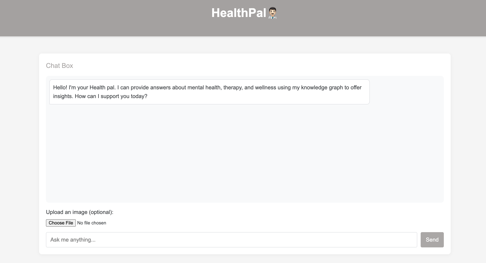

# HealthPal👨🏻‍⚕️

A Healthcare and Wellness FAQ chatbot that combines MeTTa knowledge graphs with Google's Gemini 2.0 LLM for enhanced, context-aware responses.

  


##  Features

- **Knowledge Graph Integration**: Uses MeTTa for structured knowledge representation
- **LLM Integration**: Leverages Google Gemini 2.0 for natural language understanding
- **Graph RAG**: Retrieval-Augmented Generation for context-aware responses
- **Real-time Updates**: Support for adding new FAQs
- **Context-Aware Answers**: Understands relationships and hierarchies within the domain

### Prerequisites

- Python 3.9+
- Gemini API key from [Google AI Studio](https://ai.google.dev/)

### Installation

1. Clone the repository:
   ```bash
   git clone https://github.com/Betty987/HealthPal.git
   cd HealthPal
   ```

2. Create a virtual environment:
   ```bash
   python -m venv venv
   source venv/bin/activate  # On Windows: venv\Scripts\activate
   ```

3. Install dependencies:
   ```bash
   pip install -r requirements.txt
   ```

4. Create a `.env` file with your Gemini API key:
   ```bash
   echo "GEMINI_API_KEY=your_api_key_here" > .env
   ```
5. Run the demo script
    ```bash
   python start_demo.py
   ```
6. Alternatively,you can run
    ```bash
    # Make the script executable (if not already)
    chmod +x start.sh

    # Run the start script
    ./start.sh
```

## 📁 Project Structure

```
HealthPal/
├── src/
│   ├── main.py                 # FastAPI server and API endpoints
│   ├── chat/
│   │   ├── llm.py              # Gemini LLM integration
│   │   ├── rag.py              # Graph RAG implementation
│   └── knowledge_graph/
│       ├── schema.metta        # MeTTa schema definition
│       └── data.metta          # Knowledge graph data
├── static/                     # Static assets (CSS, JS, images)
├── demo.html                   # Interactive demo interface
├── start_demo.py               # Script to start demo and open browser
├── start.sh                    # Unix/Mac startup script
├── requirements.txt            # Python dependencies
└── .env                        # Environment variables (create this)
```

